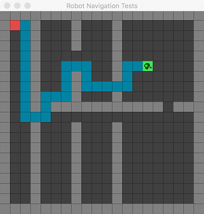

# Navigation
Java app implementing A* algorithm 
To use this application, simply run it in eclipse IDE.

#### Keyboard commands
- **C** &nbsp; Clears the visited cells on map
- **E** &nbsp; End: Goes from the current position to the destination point using A* algorithm
- **B** &nbsp; Begin: Teleports to square one
- **&#8592;** &nbsp; Navigate from one cell to the **left**
- **&#8593;** &nbsp; Navigate from one cell **up**
- **&#8594;** &nbsp; Navigate from one cell to the **right**
- **&#8595;** &nbsp; Navigate from one cell **down**

Red cell represents the origin of the map 
Green cell is the destination point

#### References
Tiles game got from the Kevin Glass's tutorial: 
http://www.cokeandcode.com/main/tutorials/tile-maps/

A* Algorith implementation: Jatin Thakur 
http://www.codebytes.in/2015/02/a-shortest-path-finding-algorithm.html 
https://www.youtube.com/watch?v=-L-WgKMFuhE
